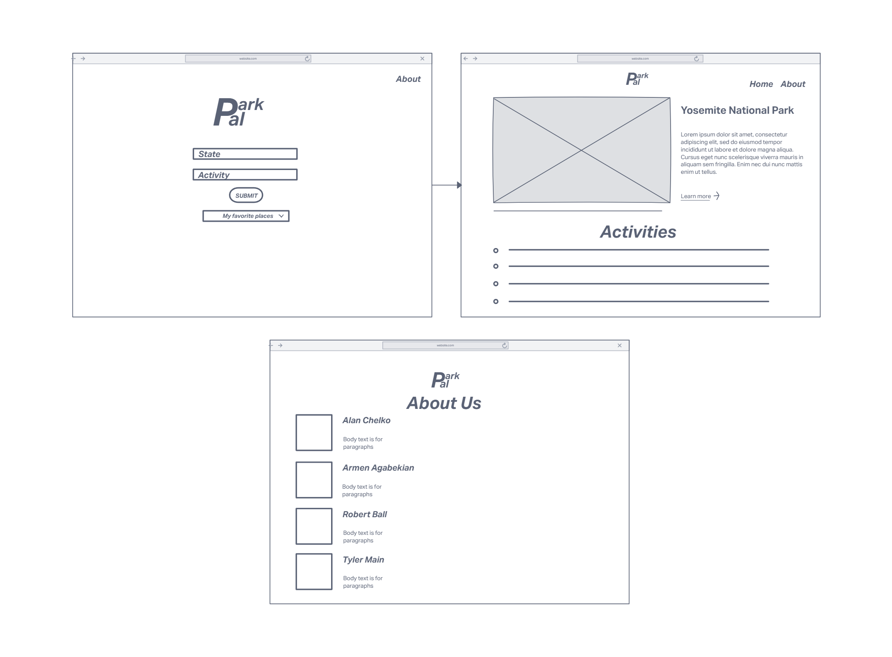
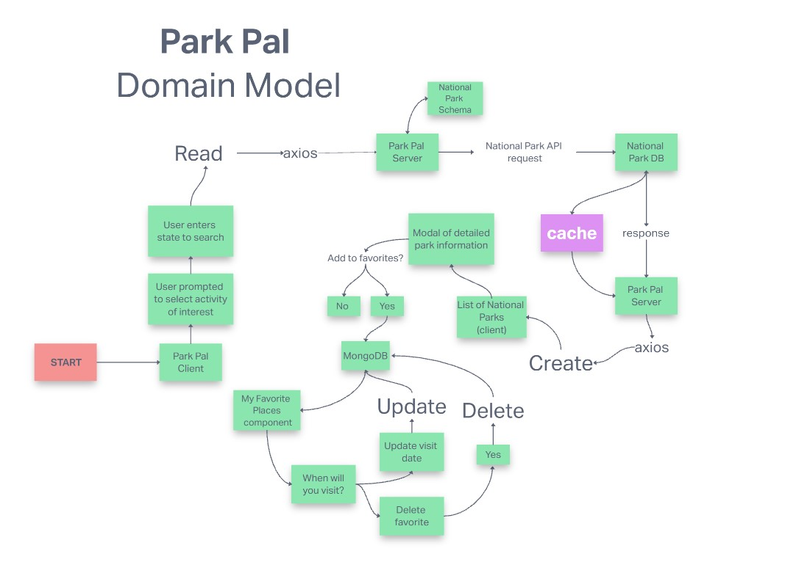

# National Park

Echo Company

* Alan Chelko

* Armen Agabekian

* Robert Ball

* Tyler Main

## Project Description

### National Park Service

* Application that allows users to select a category that they are interested in and will return a list of National Parks that fit the bill. Users can also Search by location to display National Parks

### What Problem or pain point does it solve?

* Helps users find areas to enjoy their selected interests

* Find national parks within an area of interest

### Minimum Viable Product (MVP) definition

* Generate National Park base off user input

* Display image connected to National Park

## Wireframe

## Domain model

